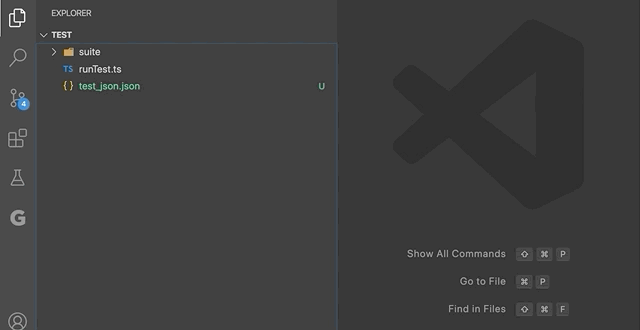
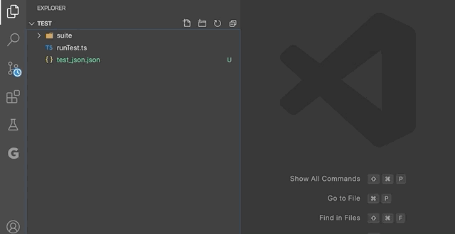

# json2built-value

Auto generate built value class files by given json structure.

## Usage

### Generate from file

Select the `JSON 2 BuiltValue: From file` command, then select a json file:

### Generate from Url

- Select the `JSON 2 BuiltValue: From Url` command
- Enter the root dart file name
- Select a folder to place the generated files

## Todo

- Support right click menu
